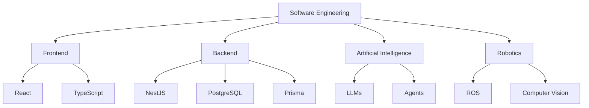

## Hi there 👋

Computer Engineering · PUC-GO

I build applications that make a positive impact on the world, and I'm deeply interested in areas where software meets the physical world.

---

### Frontend

### Backend

### Languages

### Tools & DevOps

### Exploring

### Currently Learning

---

## 🧠 Areas of Interest

- Software Engineering
- System Design
- Clean Architecture
- Artificial Intelligence
- Agentic Systems
- Robotics
- Automation
- Embedded Systems

---

## 🔭 Current Focus

- Building enterprise-grade full-stack applications
- Deepening software architecture knowledge
- Studying AI agents and LLM integrations
- Preparing for robotics and embedded systems projects

---

### 📫 Let's connect

Open to internships, collaborations, and conversations about AI, automation, and robotics.

## 🗺️ Roadmap

---

## 📊 GitHub Stats

